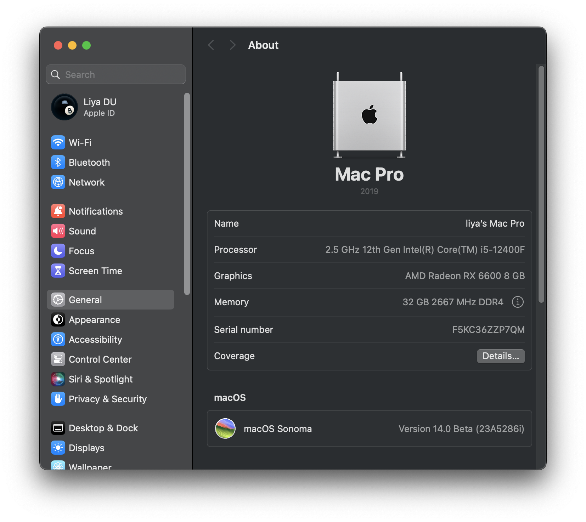

# Hackintosh - Opencore EFI for Asrock B660M-ITX/ac

Support for macOS Sonoma (14). If you are looking for Ventura (13.4) support, swtich to [ventura](https://github.com/likidu/OpenCore-ASRock-B660m-ITX-AC/tree/ventura) branch.

## Changelog

- **[3/26]**: Updated to OpenCore 0.9.9 and macOS Sonoma 14.4.1. New build [AirportItlwm-Sonoma14.4-v2.3.0-DEBUG-alpha-e886ebb.zip](https://github.com/OpenIntelWireless/itlwm/releases/download/v2.3.0-alpha/AirportItlwm-Sonoma14.4-v2.3.0-DEBUG-alpha-e886ebb.zip) is applied. While the IntelBluetoothFirmware v2.4.0 did not merge the Logitech MX fix, so now let's stick with the previous private build.
- **[1/22]**: Updated to OpenCore 0.9.7 with macOS Sonoma 14.3.
- **[9/13]**: Updated to OpenCore 0.9.5 with macOS Sonoma GM.
- **[8/24]**: Updated to macOS Sonoma beta 6 with OTA. All drivers and kexts stay the same.
- **[8/9]**: Updated to OpenCore 0.9.4 GM with macOS Sonoma beta 5.
- **[8/9]**: For Bluetooth, I am using Logitech MX Anywhere 3 mouse which has to be applied by [this patch](https://github.com/OpenIntelWireless/IntelBluetoothFirmware/pull/446) to make it work. The patch is not merged yet so I have to use the CI build from [IntelBluetoothFirmware](https://github.com/OpenIntelWireless/IntelBluetoothFirmware/actions/runs/5639869912).
- **[7/13]**: Update to OpenCore 0.9.4 beta. Intel WiFI it uses the [preview version v0.2](https://github.com/OpenIntelWireless/itlwm/issues/883#issuecomment-1625204187) which seems fully working.
- **[5/26]**: Update to OpenCore 0.9.2. Tested on macOS Ventura 13.4.
- **[4/11]**: First commit using OpenCore 0.9.1.

## Hardware

| **Component**        | **Model**                                                                              |
| -------------------- | -------------------------------------------------------------------------------------- |
| CPU                  | Intel Core i5 12400F                                                                   |
| Motherboard          | [Asrock B660M-ITX/ac](https://www.asrock.com/mb/Intel/B660M-ITXac/index.asp)           |
| RAM                  | 16GB (2 x 8GB) G.Skill @ 2666 CL15                                                     |
| GPU                  | [PowerColor Hellhound RX 6600 - 8GB](https://www.powercolor.com/product?id=1630396326) |
| OS Disk (Nvme/Sata3) | SK Hynix P31 1TB                                                                       |
| WiFi / Bluetooth     | Intel Wireless AC 9462 and Bluetooth                                                   |
| Display              | 2 x 4K (BenQ EW3270U and PD2704U) @ 60Hz on Display Port                               |



## BIOS Settings

Reference - [黑苹果华擎 Asrock 主板 BIOS 详细截图设置教程](https://www.bilibili.com/read/cv12293964)

### Prerequisites

In BIOS, use `F6` to swtich to `Advanced Mode`.

### OC Tweaker

- Intel Turbo Boost Max Technology 3.0: **Enabled**

### Advanced - CPU Configuration

- Intel Hyper-Threading Technology: **Enabled**
- **CFG Lock**: **Disabled**
- Intel Virtualization Technology: **Enabled**
- **Software Guard Extensions (SGX)**: **Disabled**

### Advanced - Chipset Configuration

- Primary Graphics Adapter: **PCIe**
- Above 4G Decoding: **Enabled**
- **C.A.M (Clever Access Memory)**: **Enabled**

### Advanced - Storage Configuration

- SATA Mode Selection: **AHCI**

### Advanced - USB Configuration

- Legacy USB Support: **Enabled**
- XHCI Hand-off: **Enabled**

### Advanced - ACPI Configuration

- PS/2 Keyboard S4/S5 Wakup Support: **Enabled**
- USB Keyboard/Remote Power On: **Enabled**
- USB Mouse Power On: **Enabled**

### Advanced - Trusted Computing

- Security Device Support: **Disabled**

### Advanced - Super IO Configuration

- Serial Port: **Enabled**

### Security

- **Secure Boot**: **Disabled**

### Boot

- Fast Boot: **Disabled**
- **CSM**: **Disabled**

## Installation

See [Installation notes](./doc/INSTALLATION.md).

## Notes

- To enable OTA update, you have to include [RestrictEvents](https://github.com/acidanthera/RestrictEvents) kext and add boot flag:

  ```text
  revpatch=auto,sbvmm,asset
  ```

- There was an issue about OpenCore will repeatly reboot until successfully get into the macOS. Removing `-v` in `boot-args` seems fix the issue.

## Reference

- [Dortania's OpenCore Install Guide](https://dortania.github.io/OpenCore-Install-Guide/)
- [OpenCore Alder Lake (12th-Gen Intel) Hackintosh Guidance](https://www.reddit.com/r/hackintosh/comments/sp1zgv/opencore_alder_lake_12thgen_intel_hackintosh/)
- [Fix shutdown and restart](https://github.com/Koala166/The-TLDR-Guide-of-Fixing-Shutdown-Restart)
- [OC Sanity Checker](https://sanitychecker.ocutils.me/)