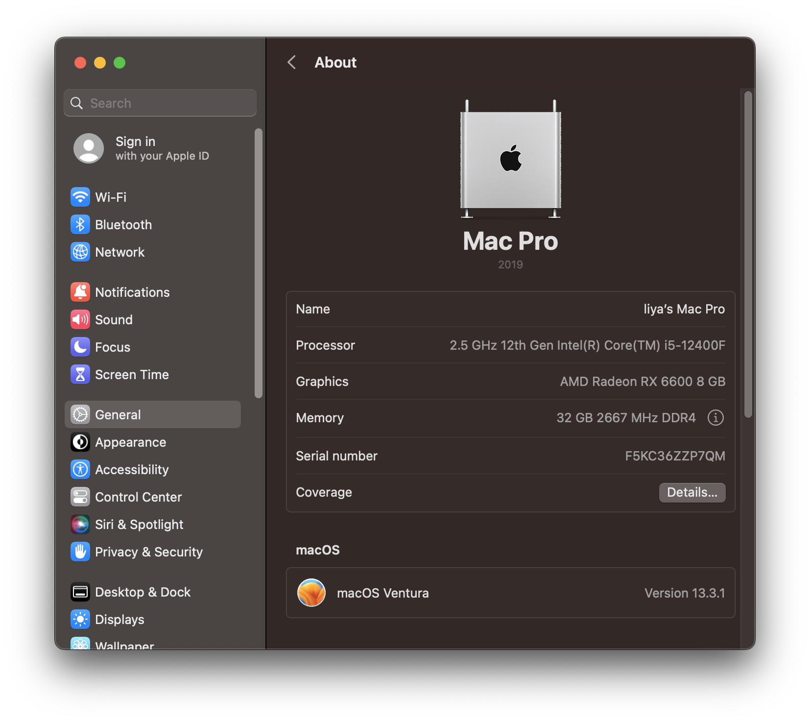

# Hackintosh - Opencore EFI for Asrock B660M-ITX/ac

**[4/11]**: First commit using OpenCore 0.9.1.

## Hardware

| **Component**        | **Model**                                                                              |
| -------------------- | -------------------------------------------------------------------------------------- |
| CPU                  | Intel Core i5 12400                                                                    |
| Motherboard          | [Asrock B660M-ITX/ac](https://www.asrock.com/mb/Intel/B660M-ITXac/index.asp)           |
| RAM                  | 16GB (2 x 8GB) GSkill @ 2666 CL15                                                      |
| GPU                  | [PowerColor Hellhound RX 6600 - 8GB](https://www.powercolor.com/product?id=1630396326) |
| OS Disk (Nvme/Sata3) | SK Hynix P31 1TB                                                                       |
| WiFi / Bluetooth     | Onboard Intel AX210 and Bluetooth                                                      |
| Display              | 2 x 4K (LG and Benq) @ 60Hz                                                            |

## BIOS Settings

Reference - [黑苹果华擎 Asrock 主板 BIOS 详细截图设置教程](https://www.bilibili.com/read/cv12293964)

### Prerequisites

In BIOS, use `F6` to swtich to `Advanced Mode`.

### OC Tweaker

- Intel Turbo Boost Max Technology 3.0: **Enabled**

### Advanced - CPU Configuration

- Intel Hyper-Threading Technology: **Enabled**
- **CFG Lock**: **Disabled**
- Intel Virtualization Technology: **Enabled**
- **Software Guard Extensions (SGX)**

### Advanced - Chipset Configuration

- Primary Graphics Adapter: **PCIe**
- Above 4G Decoding: **Enabled**
- **C.A.M (Clever Access Memory): **Enabled\*\*

### Advanced - Storage Configuration

- SATA Mode Selection: **AHCI**

### Advanced - USB Configuration

- Legacy USB Support: **Enabled**
- XHCI Hand-off: **Enabled**

### Advanced - ACPI Configuration

- PS/2 Keyboard S4/S5 Wakup Support: **Enabled**
- USB Keyboard/Remote Power On: **Enabled**
- USB Mouse Power On: **Enabled**

### Advanced - Trusted Computing

- Security Device Support: **Disabled**

### Advanced - Super IO Configuration

- Serial Port: **Enabled**

### Security

- **Secure Boot**: **Disabled**

### Boot

- Fast Boot: **Disabled**
- CSM: **Disabled**ß

## Reference

- [Dortania's OpenCore Install Guide](https://dortania.github.io/OpenCore-Install-Guide/)
- [OpenCore Alder Lake (12th-Gen Intel) Hackintosh Guidance](https://www.reddit.com/r/hackintosh/comments/sp1zgv/opencore_alder_lake_12thgen_intel_hackintosh/)
